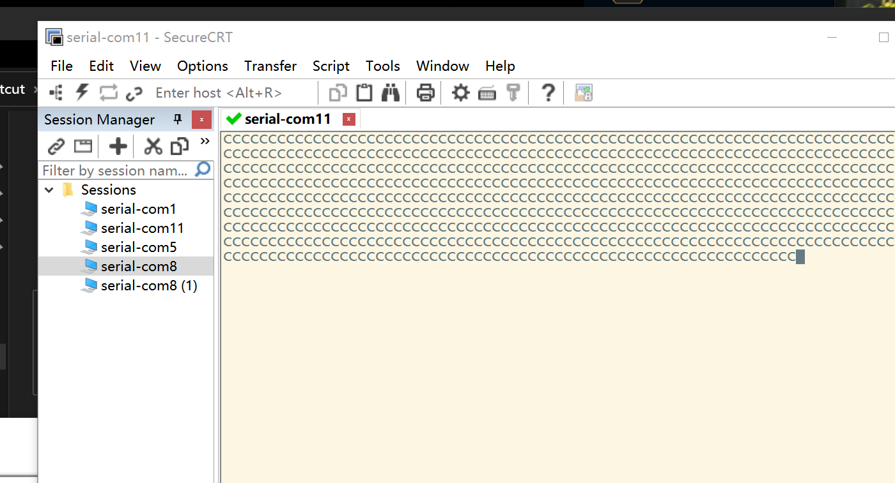
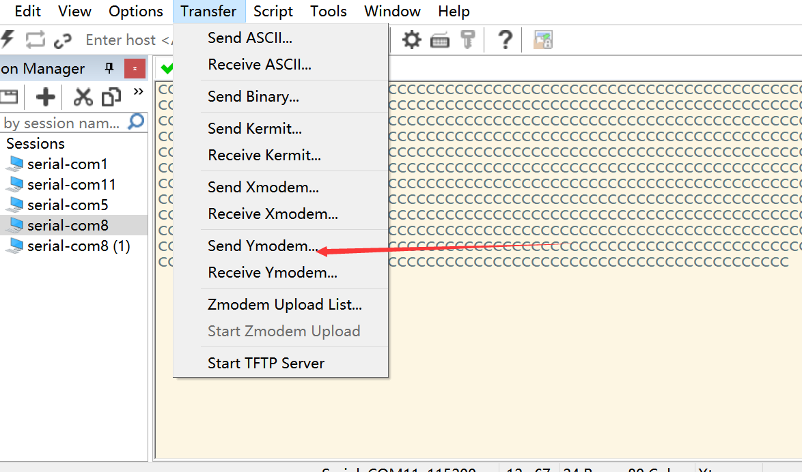
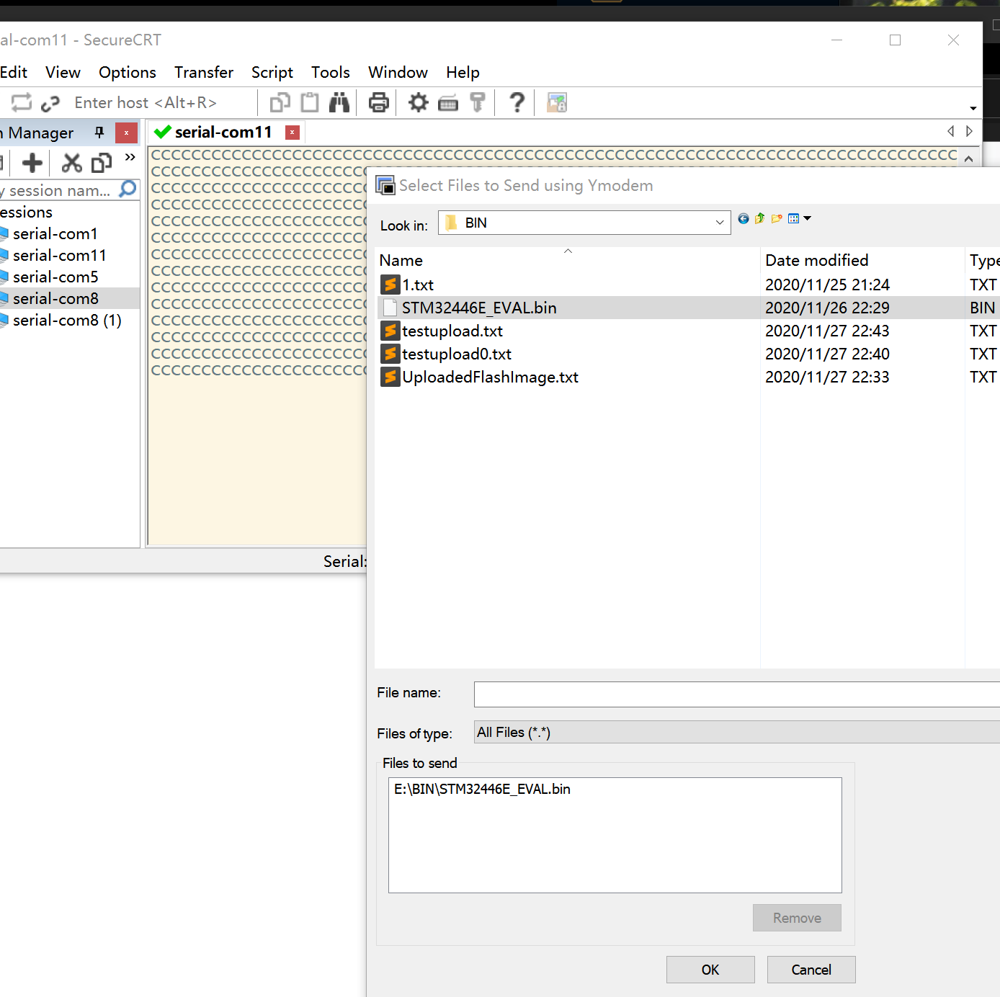
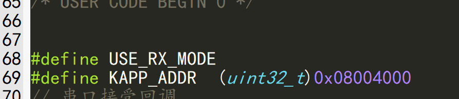
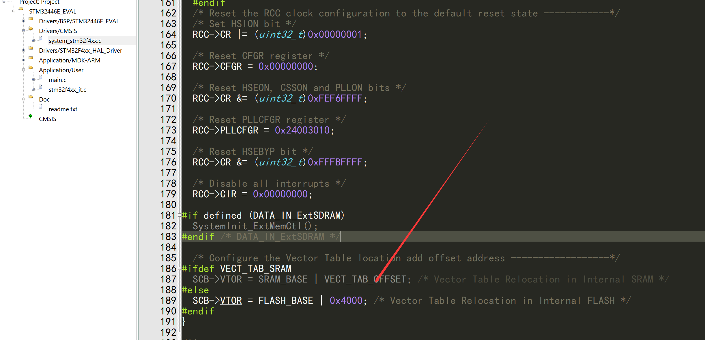
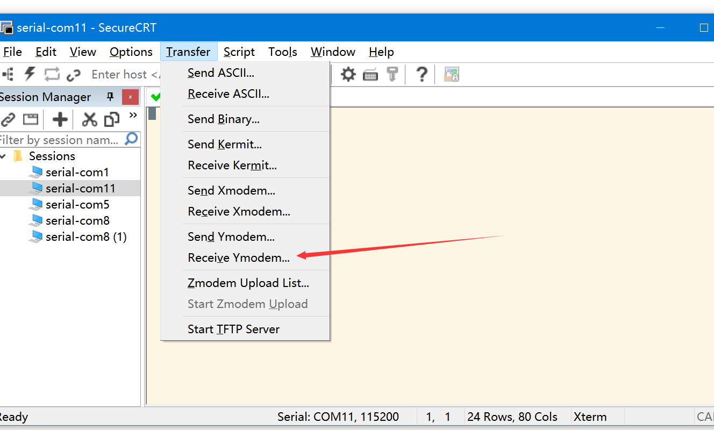
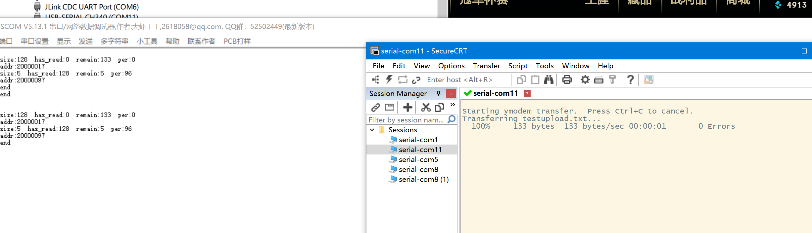
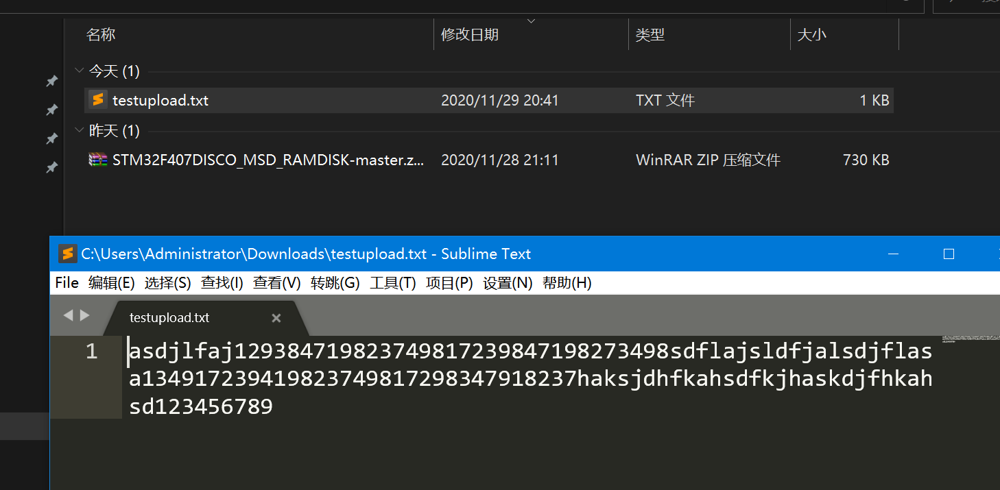
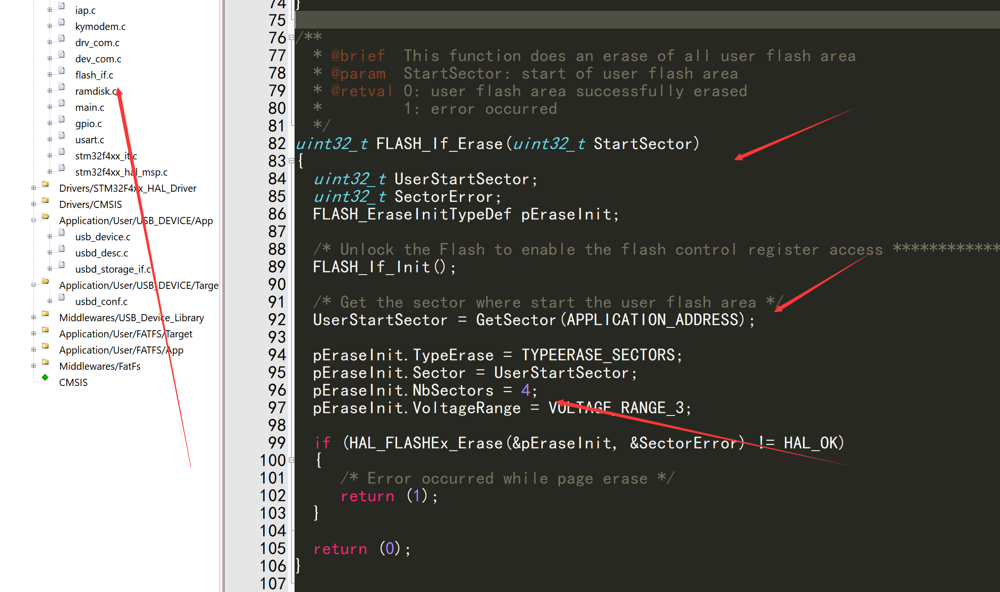
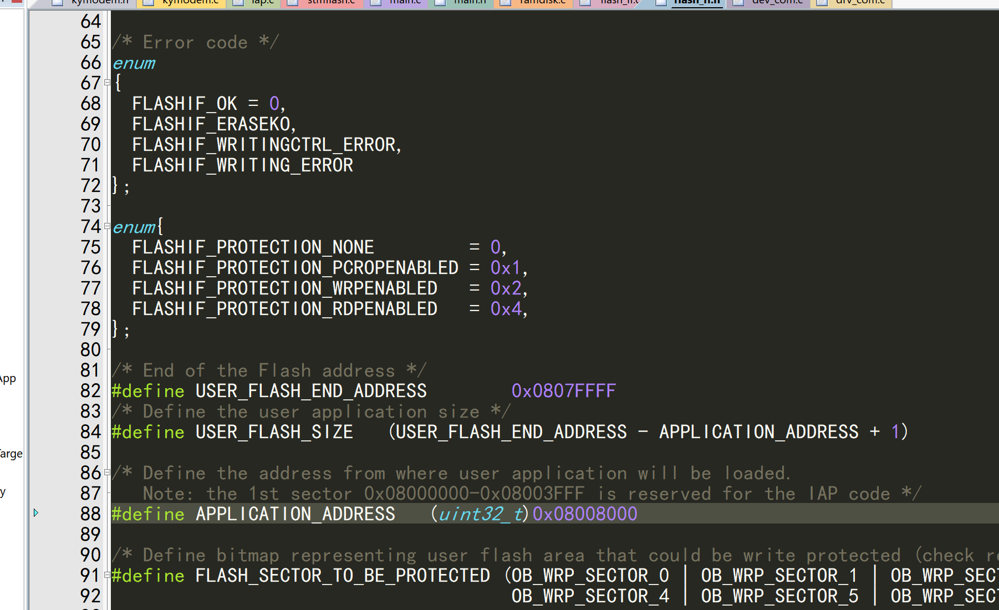

[TOC]

>
>
>kirito  2020-11-29 V1.0

# 0简介

开发板: stm32f407vgt6

IDE: keil + cubemx6.0

功能: 实现stm32HAL 串口IAP, 协议采用非阻塞式ymodem协议, 能够使用超级终端或者securRT 发送bin文件, 同时能接受文件


# 1 流程


串口中断发送过来的数据存储到缓冲区, 每次从缓冲区中拿出数据丢到数据解析器,  解析出每帧.

```c
// 可以切换接受和发送模式
#define USE_RX_MODE
#define KAPP_ADDR  (uint32_t)0x08004000
// 串口接受回调
void g_com_rx_callBack(unsigned char* data,uint32_t size)
{
	#ifdef USE_RX_MODE
	ymodem_rx_handle(data,size);
	#else
	ymodem_tx_handle(data,size);
	#endif
}

// 串口错误回调
void g_ymodem_rx_error_handle(int error_code)
{
	printf("--error code :%d--\r\n",error_code);
}
// 接受head回调
char g_ymodem_rx_head_handle(char *file_name,uint16_t file_name_len, uint32_t file_len)
{
	printf("file:%s %d\r\n",file_name,file_len);
	FLASH_If_Erase( KAPP_ADDR);
	return 0;
}
uint32_t app_addr = KAPP_ADDR;

// 接受数据回调
void g_ymodem_rx_data_handle(char *data, uint16_t len,uint32_t download_byte,uint8_t percent)
{
	printf("data len:%d  %d %d\r\n",len,download_byte ,percent);
	if (FLASH_If_Write(app_addr,(uint32_t*) data,len/4) == FLASHIF_OK)
	{
		app_addr += len;
		printf("data write ok\r\n");
	}else{
		printf("data write error\r\n");
	}
}

// 接受完成回调
void g_ymodem_rx_finish_handle(int state)
{
	if(state ==0){
		printf("--file end--\r\n");
		iap_load_app(KAPP_ADDR);
	}else{
		printf("--file end error1 :%d--\r\n",state);
	}
}
// 发送数据处理
void g_ymodem_tx_data_handle(uint8_t **file_read_addr, uint32_t  file_read_size, uint32_t file_has_read_size,  uint32_t file_remain_size,uint8_t percent)
{
	printf("read size:%d  has_read:%d  remain:%d  per:%d\r\n",file_read_size,file_has_read_size,  file_remain_size,percent);
			// 指针指向的地址 重新指向
		*file_read_addr = &file[file_has_read_size];
}
int main()
{
    // 注册串口缓冲区回调
    dev_comctrl_init();
	dev_comctrl_regist_rx_callback(g_com_rx_callBack);
	
	// 注册ymodem回调
	Ymodem_TypeDef ymodem;
	ymodem.ymodem_write_byte = drv_com1_write;
	ymodem.ymodem_rx_error_handle = g_ymodem_rx_error_handle;
	ymodem.ymodem_rx_head_handle = g_ymodem_rx_head_handle;
	ymodem.ymodem_rx_data_handle = g_ymodem_rx_data_handle;
	ymodem.ymodem_rx_finish_handle = g_ymodem_rx_finish_handle;
	ymodem.ymodem_tx_data_handle = g_ymodem_tx_data_handle;
	ymodem_init(&ymodem);
  // 循环
  while (1)
  {		// 串口缓冲区处理
		dev_comctrl_handle();
      // ymodem定时处理
		ymodem_rx_time_handle();
    
    return 0;
}
```

# 2 发送模式使用:

## 1 流程

把宏定义注释打开,就是往单片机写数据

```
#define USE_RX_MODE
```


软件: securRT或者超级终端都可以

1  重启32,  会一直发C



可以选择传输速度, 代码2个速度都支持


2 选择transfer -> send ymodem , 选择要发送的文件



选中固件之后, 直接点击发送




如果接了串口2, 就会看到打印的debug信息


## 2 更新的APP固件设置:

bootloader的地址是0x800400



所以APP中需要把中断向量偏移



同时设置这个地址


# 3 接受模式使用

## 1 流程

把宏定义去掉

```
// #define USE_RX_MODE
```

打开接受模式






去设置中看下载位置, 一般在/user/下载目录

注意的是:

```c
// 发送数据处理
void g_ymodem_tx_data_handle(uint8_t **file_read_addr, uint32_t  file_read_size, uint32_t file_has_read_size,  uint32_t file_remain_size,uint8_t percent)
{
	printf("read size:%d  has_read:%d  remain:%d  per:%d\r\n",file_read_size,file_has_read_size,  file_remain_size,percent);
			// 指针指向的地址 重新指向
		*file_read_addr = &file[file_has_read_size];
}
```

file_read_addr是指针的指针, 用于重定向指针指向, 所以每次发送数据后都要重新指定, 避免发送重复  ,这种使用的最好场景就是大文件的发送, 可以开1K的缓冲区, 然后每次发送之后重新指定指针指向

# 如果下载失败,或者擦除失败

注意除了main.c 有定义用户启动地址, flash_if.h .c中也定义了APP地址和要擦除的扇区





如果往stm32写数据失败, 注意flash_if.c里面的扇区擦除, 如果目前代码太大,超过了之前设置的代码, 那么就造成失败

所以一定要预留好bootloader的flash空间